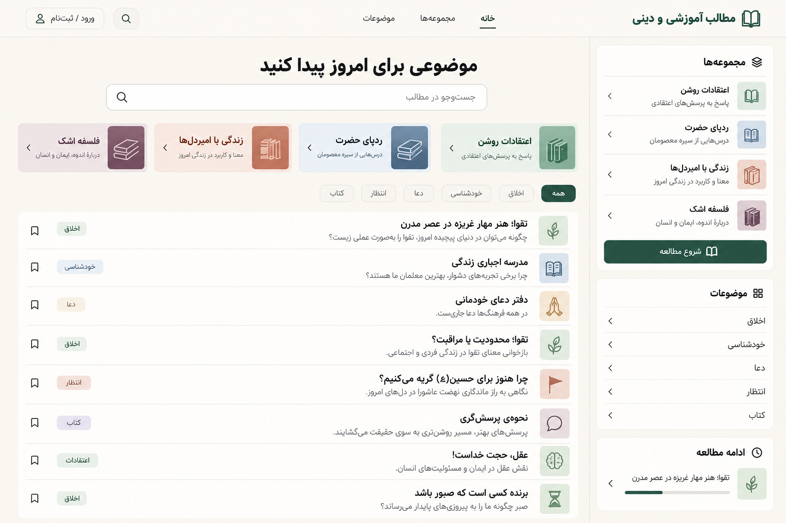
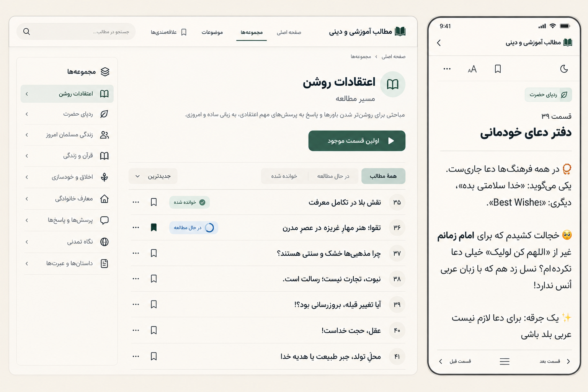

# طرح قالب و نمای کلی سایت

این سند ادامه طرح قبلی و پاسخ به درخواست نمایش تعداد زیادی موضوع کوتاه است. فرض طراحی: هر مطلبِ تأییدشده یک عنوان قابل مرور و پیش‌نمایش کوتاه دارد؛ متن کامل در صفحه مستقل خوانده می‌شود. کوتاه‌بودن کارت به معنی کوتاه‌سازی یا بازنویسی اصل پیام نیست.

## قالب پیشنهادی

قالب یک کتابخانه موضوعی فارسی با چیدمان RTL است: زمینه کاغذی روشن، متن تیره، سبز عمیق برای کنش‌ها، فونت فارسی خوانا و جداکننده‌های ظریف. تصویرهای بزرگ، اسلایدر و تزئینات پرحجم اولویت ندارند؛ بخش عمده اولین صفحه به موضوعات و عنوان‌های قابل انتخاب اختصاص دارد.

نام نهایی سایت هنوز انتخاب نشده است. در نمونه‌های تصویری عنوان رابط «مطالب آموزشی و دینی» به‌عنوان عنوان موقت استفاده می‌شود، نه برند قطعی.

## نمای خانه

1. سربرگ کوتاه: عنوان سایت، خانه، مجموعه‌ها، موضوعات، جست‌وجو و حساب.
2. معرفی یک‌خطی و کادر جست‌وجوی واضح؛ بدون hero تمام‌صفحه.
3. چهار مسیر مجموعه: اعتقادات روشن، ردپای حضرت، زندگی با امیردل‌ها و فلسفه اشک. نمایش مجموعه چهارم تنها پس از تأیید تحریریه.
4. فیلترهای موضوعی پیشنهادی: خودشناسی، اخلاق، دعا، انتظار، معرفت، کتاب و تربیت. این‌ها برچسب‌های طراحی برای بازبینی‌اند؛ هنوز taxonomy واقعیِ تأییدشده JSON نیستند.
5. فهرست عنوان‌ها در ردیف‌های کوتاه با مجموعه، پیش‌نمایش یک‌خطی از اصل متن، زمان تقریبی و نشانک. در دسکتاپ حدود ۸ تا ۱۲ ورودی قابل مرور در viewport نمونه؛ هدف افزایش تراکم بدون ریزکردن متن است.
6. ستون باریک دسکتاپ برای مجموعه‌ها و شروع پیشنهادی؛ در موبایل به دکمه فیلتر و بخش جمع‌شونده تبدیل می‌شود.

صفحه اصلی از ترتیب تحریریه استفاده می‌کند؛ «جدیدترین» فقط بر اساس زمان انتشار واقعی سایت معنا دارد. هیچ تاریخ یا شمار مطلب تأییدشده از metadata خام ساخته نمی‌شود.

## قالب مجموعه و مطالعه

صفحه مجموعه یک معرفی کوتاه، دکمه «اولین قسمت موجود»، موضوع‌ها و فهرست قسمت‌های مرتب دارد. شماره، عنوان و وضعیت خواندن در هر ردیف دیده می‌شود. تعداد و پیشرفت از محتوای منتشرشده محاسبه می‌شوند؛ شمردن تکرارهای منبع مجاز نیست.

صفحه مطلب برای خواندن آرام، یک ستون باریک و متن کامل دارد؛ عنوان کوتاه کارت به همان نسخه کامل پیوند می‌خورد. ابزار قلم، پوسته و نشانک کوچک‌اند. دکمه «خواندم» و ناوبری قبلی/بعدی در پایان متن قرار دارند. موبایل حاشیه کافی، لمس بزرگ و کادرهای کم‌ارتفاع دارد؛ تعداد زیاد عنوان‌ها به معنای انباشتن کل متن‌ها در خانه نیست.

## نمونه محتوایی تصاویر

عنوان‌های نمونه مستقیماً از JSON انتخاب شده‌اند: «تقوا؛ هنرِ مهارِ غریزه در عصرِ مدرن»، «مدرسه اجباری زندگی»، «دفتر دعای خودمانی»، «تقوا؛ محدودیت یا مراقبت؟» و «چرا هنوز برای حسین(ع) گریه می‌کنیم؟». جایگاه و برچسب‌ها در تصویر صرفاً نمونه طراحی‌اند؛ تصویربرداری از سایت پیاده‌شده نیست.

## خروجی بصری و مراحل بعد

دو تصویر مفهومی: نمای دسکتاپ صفحه اصلی با ورودی‌های کوتاه؛ و نمای مجموعه دسکتاپ کنار صفحه مطالعه موبایل. تصاویر با ابزار داخلی image generation ساخته می‌شوند و صحت نهایی حروف‌چینی فارسی باید در پیاده‌سازی با متن واقعی کنترل شود. promptهای استفاده‌شده کنار تصاویر نگهداری می‌شوند.

ترتیب تصمیم: بازبینی این جهت بصری → انتخاب تراکم و رنگ → طرح دقیق موبایل/دسکتاپ → برش اجرایی محدود طبق نقشه راه. تولید تصاویر مجوز شروع کد برنامه یا انتشار محتوا نیست.

## تصاویر ذخیره‌شده

[متن promptهای تولید تصویر](design/image-prompts.md). ابزار استفاده‌شده: built-in image generation.

متن، توضیح‌های یک‌خطی و بعضی نام‌ها در خروجی تصویری توسط مدل تصویر تقریب زده شده‌اند؛ این خروجی مرجع صحت محتوای دینی یا taxonomy نیست. بعضی گزینه‌های ستون جانبی تصویر دوم موضوع پیشنهادی‌اند و نام مجموعه تأییدشده نیستند. برای پیاده‌سازی، نام مجموعه‌ها مطابق JSON/تأیید editor و عنوان و excerpt از اصل متن گرفته می‌شوند. فایل‌های JSON اصلی تغییر نکرده‌اند.
