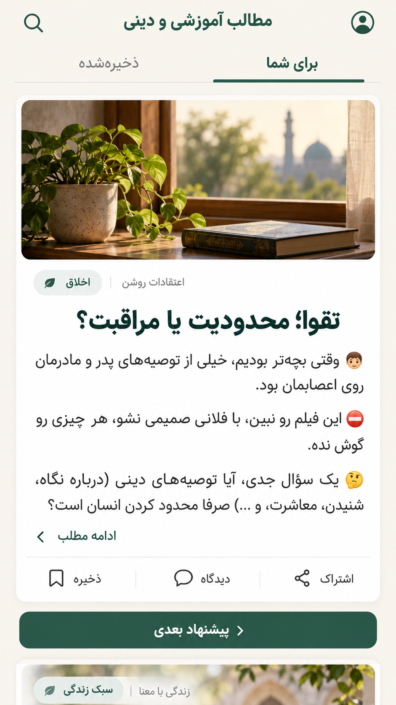
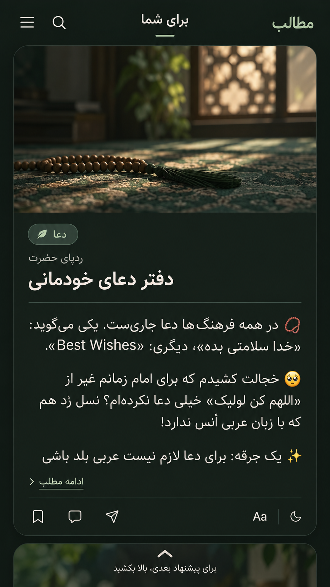
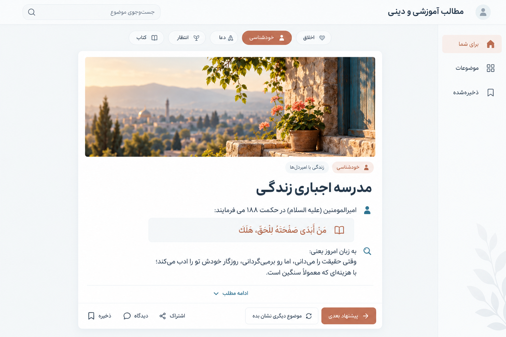

# پیشنهاد تک‌پست به‌جای مسیر مجموعه

طبق درخواست تازه، مرکز تجربه یک پست پیشنهادی در هر لحظه است؛ کاربر مانند یک فید اجتماعی به پیشنهاد بعدی می‌رود. صفحه اصلی کتابخانه، فهرست قسمت‌ها و سیر اجباری خواندن مبنای طراحی نیستند. این تصمیم برای تجربه عمومی بر طرح قالب سند ۱۰ و مسیر مجموعه‌محور اسناد قبلی تقدم دارد.

سه جهت بصری: فید روشن کاغذی برای موبایل؛ فید تاریک و متمرکز برای موبایل؛ فید روشن با یک کارت مرکزی در دسکتاپ. هر سه متن‌محور و بدون تصویر بزرگ اجباری هستند.

## رفتار پیشنهادی

- یک کارت اصلی با عنوان، موضوع و متن یا excerpt عیناً برگرفته از اصل؛ «ادامه مطلب» متن کامل را باز می‌کند.
- ذخیره، دیدگاه و اشتراک‌گذاری زیر پست؛ هیچ شمارنده ساختگی در نمونه‌ها.
- سوایپ/اسکرول یا دکمه «پیشنهاد بعدی» برای کشف پست دیگر؛ این دکمه به شماره قسمت یا ترتیب مجموعه متصل نیست.
- نام‌های اعتقادات روشن، ردپای حضرت و زندگی با امیردل‌ها فقط metadata هستند، نه مسیر لازم برای خواندن.
- فیلتر موضوعی و «موضوع دیگری نشان بده» اختیاری؛ مطالعه بدون حساب ممکن است.
- پیشنهاد اولیه با انتخاب تحریریه، تنوع موضوع و پرهیز از تکرار اخیر آغاز می‌شود؛ الگوریتم یادگیری ماشین لازم نیست. داده خام، تکرارها و موارد تأییدنشده وارد فید نمی‌شوند.
- با نبود JavaScript، لینک پست و دکمه پیشنهاد بعدی کار می‌کنند؛ سوایپ معادل دکمه‌ای و keyboard دارد.

تصاویر مفهومی‌اند؛ تولید آن‌ها شروع پیاده‌سازی نیست. متن فارسی رندرشده توسط مدل تصویر مرجع صحت نقل‌ها محسوب نمی‌شود؛ نسخه اجرایی از متن حفظ‌شده استفاده می‌کند.

## سه پیشنهاد تصویری

تصویرهای تزئینی داخل نمونه‌ها پیشنهاد بصری‌اند و از JSON استخراج نشده‌اند؛ تصویر همراه پست در محصول اختیاری خواهد بود. [promptهای سه تصویر](design/feed-image-prompts.md)؛ ابزار داخلی image generation استفاده شده است.
