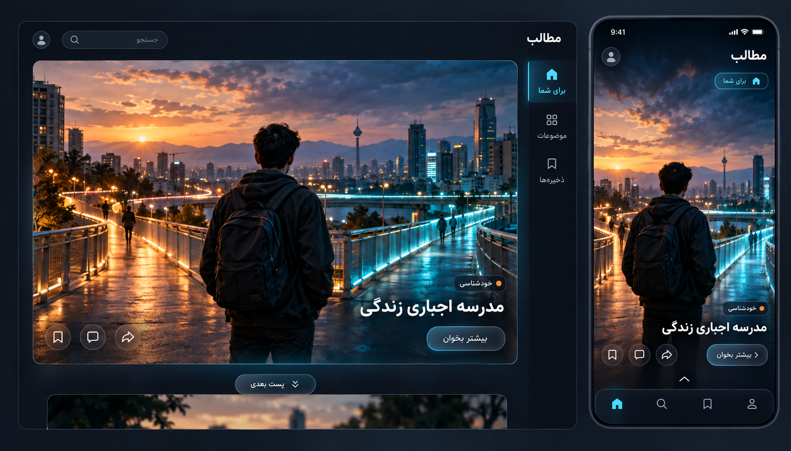

# فید تصویری برای مخاطب ۱۷ تا ۲۰ سال

در این جهت تازه، PC و موبایل یک پست پیشنهادی مشترک با تصویر بزرگ نشان می‌دهند. پیش از بازکردن متن، فقط عنوان، یک موضوع و دکمه «بیشتر بخوان» دیده می‌شود؛ متن کامل عیناً از منبع حفظ‌شده در نمای مطالعه باز خواهد شد.

طراحی پیشنهادی: زمینه زغالی، accent آبی روشن و نارنجی گرم، لایه‌های شیشه‌ای محدود، نور حاشیه و عمق تصویری. تصویر اصلی حدود سه‌چهارم کارت است. برای نمونه «مدرسه اجباری زندگی»، یک تصویر سینمایی از انتخاب مسیر شهری استفاده می‌شود؛ تصویر نماد موضوع است و مدرک یا تصویر واقعه‌ای در متن نیست.

PC یک کارت مرکزی و ناوبری باریک دارد؛ موبایل همان پست را با تصویر بزرگ و کنش‌های لمس‌پذیر نمایش می‌دهد. ذخیره، دیدگاه، اشتراک و «پست بعدی» باقی‌اند. پیشنهادها مستقل از ترتیب مجموعه‌ها هستند.

جلوه‌های نور و شیشه عمدتاً استاتیک‌اند؛ motion اختیاری با reduced-motion غیرفعال خواهد شد. تصویر تزئینی نباید متن روی آن را ناخوانا کند و overlay تیره و حالت focus لازم است. در اجرا از تصاویر دارای مجوز یا ساخته‌شده و تأییدشده برای هر موضوع استفاده می‌شود؛ JSON فعلی عکس واقعی ارائه نمی‌کند.

این فایل طرح مفهومی است؛ برنامه هنوز پیاده‌سازی نشده است. مخاطب ۱۷ تا ۲۰ سال بر زبان بصری و تراکم کم متن اثر دارد، بدون فرض یکسان‌بودن سلیقه همه مخاطبان.

[prompt تولید تصویر](design/visual-feed-prompt.md). ابزار داخلی image generation استفاده شده است.
