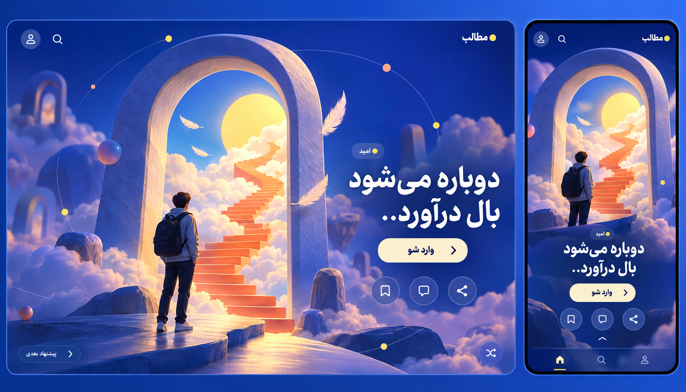

# درگاه یک فکر

یک جهت تجربی تازه: هر پست پیشنهادی یک صحنه تصویری مستقل است. نمونه موضوع امید از عنوان «دوباره می‌شود بال درآورد..» در JSON الهام می‌گیرد؛ درگاه، ابر و پله‌ها استعاره تصویری‌اند، نه گزارش محتوای منبع.

PC و موبایل همان پست را نشان می‌دهند. فقط عنوان و یک موضوع پیش از بازکردن متن دیده می‌شود. «وارد شو» متن کامل را باز می‌کند؛ ذخیره، دیدگاه، اشتراک و پیشنهاد بعدی مستقل از ترتیب مجموعه‌اند. در اجرا عنوان action با آزمون کاربری ممکن است به «بخوان» تغییر کند تا معنای بازکردن مطلب روشن‌تر باشد.

برای حفظ عملکرد، صحنه می‌تواند تصویر بهینه‌شده با کنترل‌های HTML روی آن باشد؛ WebGL لازم نیست. حرکت تزئینی اختیاری، محدود و با reduced-motion خاموش است. ناوبری و خواندن با keyboard و متن جایگزین نیز ممکن‌اند. این طرح ویرایش متن منبع یا شروع برنامه‌نویسی نیست.

[prompt تصویر](design/thought-portal-prompt.md). ابزار داخلی image generation استفاده شده است.
