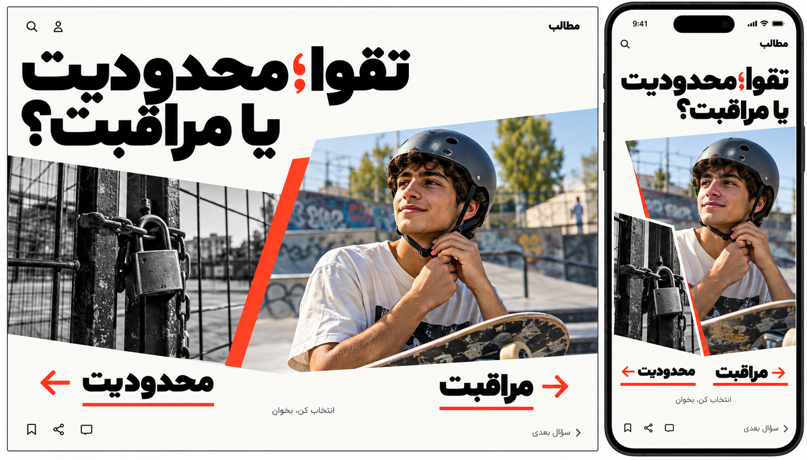

# شروع از یک سؤال تصویری

طرح‌های قبلی برای انتخاب بصری کنار گذاشته شده‌اند؛ فایل‌هایشان به‌عنوان سابقه ایده باقی می‌مانند. جهت جدید: هر بار یک سؤال از یک پست، دو تصویر استعاری و امکان بازکردن متن اصلی. نمونه «تقوا؛ محدودیت یا مراقبت؟» از JSON انتخاب شده است.

یکی از تصاویر استعاره محدودیت و دیگری مراقبت است. هر دو انتخاب، همان متن اصلی را باز می‌کنند؛ نظرسنجی، جواب ساختگی یا دو نسخه بازنویسی‌شده از محتوا وجود ندارد. «سؤال بعدی» پست پیشنهادی تازه نشان می‌دهد و به شماره مجموعه وابسته نیست.

رنگ سفید، سیاه و قرمز، حروف درشت و برش نامتقارن عکس‌ها جایگزین کارت، درگاه سه‌بعدی و جلوه نور شده‌اند. PC و موبایل یک محتوای مشترک دارند. حالت مطالعه متن کامل مستقل و خوانا خواهد بود. تصویرها تولیدشده و استعاری‌اند؛ عکس‌های واقعی ضمیمه JSON نیستند. در اجرا کنترل‌ها با keyboard و screen reader قابل استفاده و عکس تزئینی از بیان متن متمایز می‌شود.

[prompt ساخت تصویر](design/question-first-prompt.md)؛ ابزار داخلی image generation.
