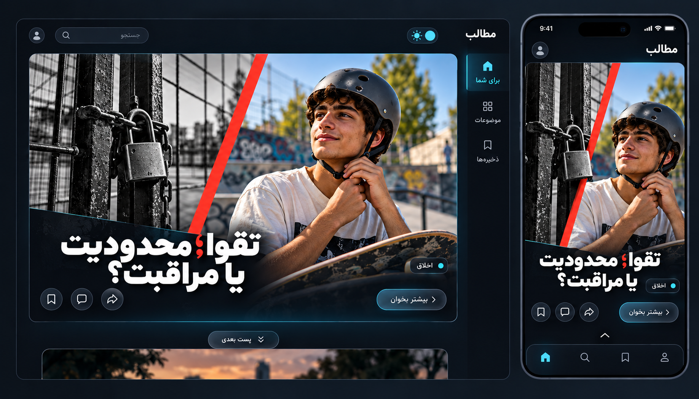
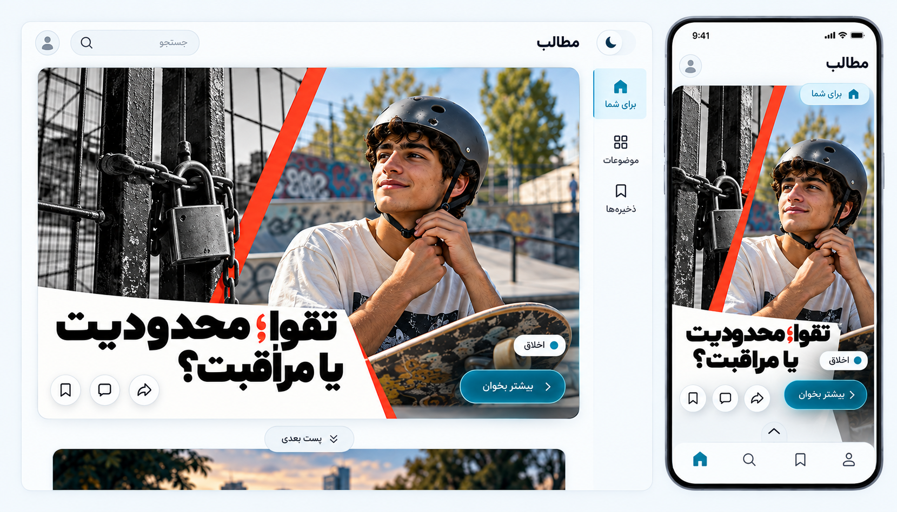

# طرح انتخاب‌شده: City Perspectives

انتخاب کاربر: ساختار تصویر ۶ «City Paths» و سبک تصویر هر پست از تصویر ۸ «Two Perspectives»، با حالت روشن و تاریک. این انتخاب بر ایده‌های قبلی تقدم دارد؛ هنوز مرحله طراحی است.

## ساختار ثابت

یک پست پیشنهادی در هر لحظه؛ PC با کارت تصویری بزرگ و ناوبری باریک سمت راست، موبایل با همان پست و ناوبری پایین. سربرگ کوتاه، جست‌وجو، حساب، تغییر پوسته، ذخیره، دیدگاه، اشتراک و «پست بعدی» باقی می‌مانند. متن کامل با «بیشتر بخوان» باز می‌شود؛ فید مسیر شماره‌دار مجموعه نیست.

## سبک تصویر پست

عکس‌های مرتبط با موضوع، برش مورب، ترکیب تک‌رنگ و رنگی، accent قرمز و عنوان کوتاه خوانا در محدوده تصویر. ساختار تمام‌صفحه سؤال‌محور و انتخاب دوتایی تصویر ۸ منتقل نمی‌شود؛ فقط زبان بصری تصویرش استفاده می‌شود. موضوع‌هایی که تضاد دوتایی ندارند با برش عکسی/عنصر مرتبط دیگری نشان داده می‌شوند؛ به محتوای اصلی معنای ساختگی تحمیل نمی‌شود.

نمونه فعلی عنوان «تقوا؛ محدودیت یا مراقبت؟» با تصویر استعاری قفل و کلاه محافظ دارد. تصویرها از JSON استخراج نشده‌اند؛ تولید یا تهیه مجاز و تأیید تحریریه لازم است. عنوان نهایی از metadata تأییدشده و متن کامل از منبع حفظ‌شده می‌آید.

## دو پوسته یکسان در رفتار

| token | Dark | Light |
|---|---|---|
| canvas | `#10151F` | `#F4F7FA` |
| surface | `#1C2330` | `#FFFFFF` |
| text | `#F2F5F9` | `#152131` |
| action | `#68D9EF` | `#006C85` |
| accent تصویر | قرمز ثابت | قرمز ثابت |

این مقادیر پیشنهادی‌اند و contrast در پیاده‌سازی اندازه‌گیری می‌شود. عکس، عنوان، ترتیب، crop معنایی و کنش‌ها با عوض‌کردن theme عوض نمی‌شوند. theme اول از سیستم، سپس انتخاب ذخیره‌شده کاربر می‌آید؛ کنترل با نام قابل دسترس، focus و keyboard دارد. overlay عنوان از پوسته مستقل است تا در هر دو روی عکس خوانا بماند. رنگ نباید تنها نشان وضعیت باشد. حرکت محدود و reduced-motion رعایت می‌شود.

نام نمونه‌های تازه: **City Perspectives — Dark** و **City Perspectives — Light**. هر تصویر PC و موبایل را کنار هم نمایش می‌دهد. خروجی‌ها mockup هستند؛ رفتار تعاملی و کد سایت هنوز ساخته نشده‌اند.

## City Perspectives — Dark

## City Perspectives — Light

[promptهای تصویر](design/selected-hybrid-prompts.md). ابزار داخلی image generation با دو تصویر مرجع استفاده شد. اختلاف‌های جزئی crop، جای عنوان و کنترل‌ها در خروجی تصویر، قرارداد responsive نیستند؛ پیاده‌سازی باید ترتیب و کنترل‌های یکسان، از جمله theme toggle در موبایل، را حفظ کند.
